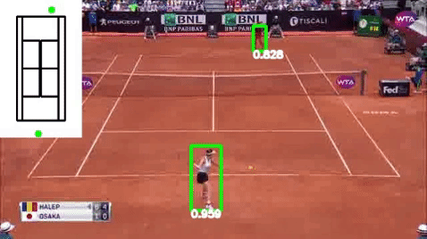
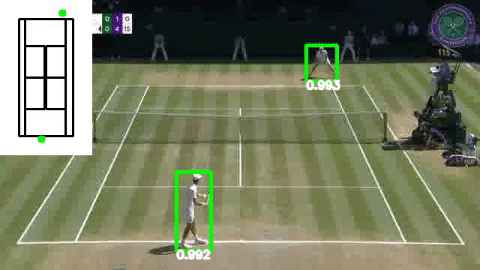
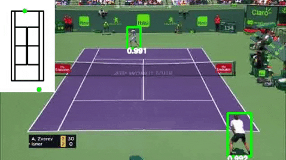

# Deeptennis

A project which applies various machine learning, deep learning, and computer vision techniques
to videos of professional tennis matches.

|   |  |
| ----------------------- | ----------------------- |
|  |  | 
|  |  |


## Installation

In a virtual environment:

```bash
pip install -r requirements.txt
```


## Generate frames from training videos

```
make frames FPS=1 VFRAMES=2000
```

